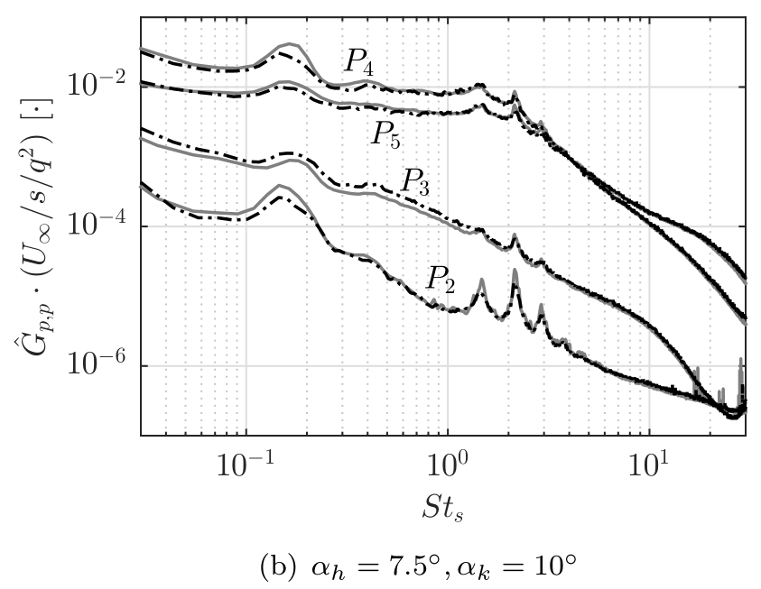
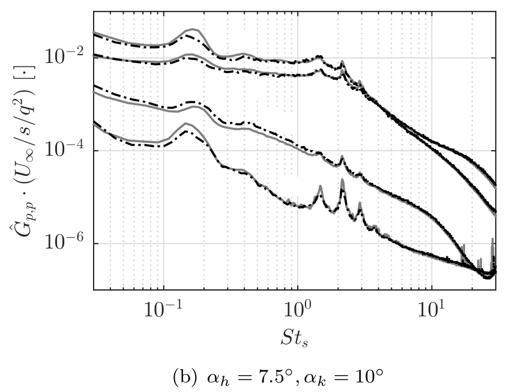
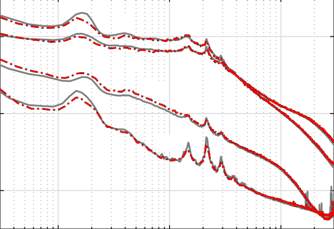

# Digitize Data from Scientific Plots

## Points

For discrete data points in a scientific plot, if not so many points are to be extracted, just use the following tools. I recommend the 2nd. It could export your calibration datasets and import it in the future. The default output format is xml. But you can use a small [python script](./xml2csv.py) to convert it to csv format.

- [WebPlotDigitizer](https://apps.automeris.io/wpd/)
- [Plot Digitizer](http://plotdigitizer.sourceforge.net)

## Curve

For a plot like the following one, we want to extract the black dash line. And note this is in log scale.

I do the following steps to extract all data points on this curve with a pixel-wise resolution.

1. Crop the figure with the plot remained.
2. Remove the letters like $P_2$.
3. Convert the pixel matrix from RGB color space to gray scale. Use the gray scale to filter the black curve Extract the corresponding pixel. The grayscale value of the black color is 0.0. But I set the threshold to be 0.1.
4. Transform the pixel matrix to the real scientific datasets. If necessary, employ the log scale.

The removal of the letters, which is done by this script [preprocess.py](./preprocess.py), means

The extraction of the corresponding pixel would be like

Step 3 and 4 are done in the script [extract_curve.py](./extract_curve.py). The extracted scientific dataset is [Pascioni2016_Spectra.csv](./Pascioni2016_Spectra.csv).

If the curves in the raw figure are of various colors, we could extract the curve by setting the RGB value. Like the red color is `(255,0,0)`.